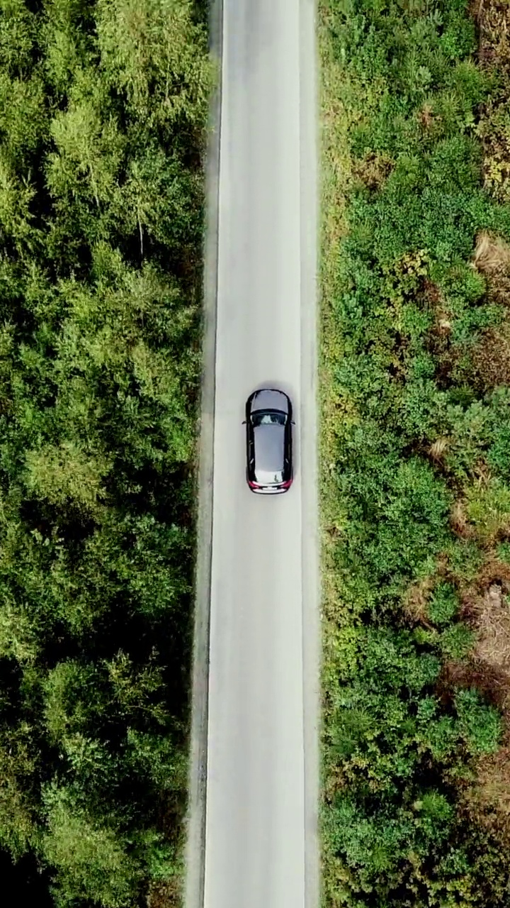
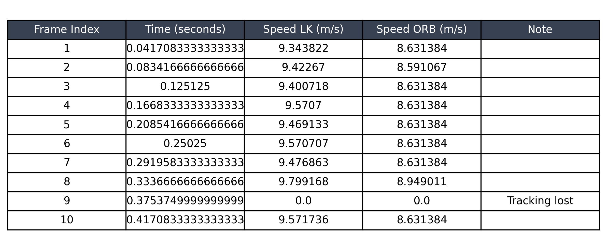
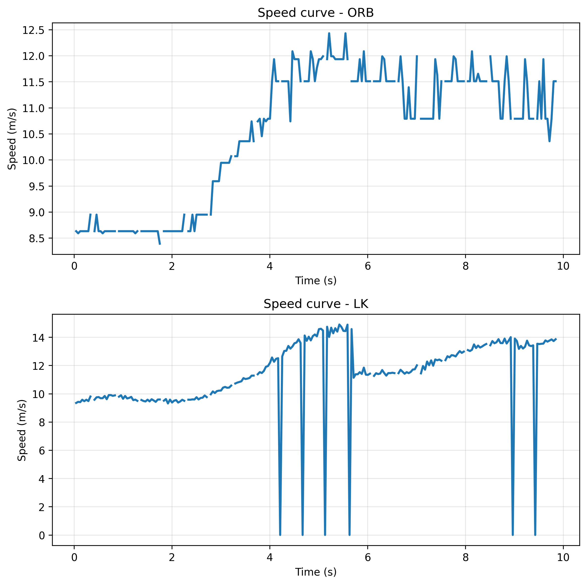

# 🚁 Drone Speed Estimation – from Monocular Video

## 📌 Abstract

This project estimates approximate drone motion over time based on image-plane displacement from a monocular video using classical computer vision techniques.

The system computes inter-frame motion using two approaches:

- Lucas–Kanade Optical Flow (LK)
- ORB Feature Matching

Pixel displacement is converted into real-world speed using a fixed scaling factor.

---


## 🎥 Sample Input Video
A sample drone video is included in `data/input/drone_video.mp4`.

If preview is not available, click "View raw" to download the video.

---

## 🖼️ Input Visualization

### Original Frame (mid-video)



---

## 🧠 Main Challenge

The main challenge is converting pixel displacement into approximate real-world speed (m/s).

Since a monocular camera does not provide depth information, a fixed scale factor is used:

```python
distance = sqrt(dx_m^2 + dy_m^2)
speed = distance * FPS
```

Where:

-  dx_m, dy_m are the displacements in meters (after applying pixel_to_meter scaling)
- `pixel_to_meter = 0.05` is a fixed scaling factor used to convert pixel motion into meters  
- `FPS` is the video frame rate  

---

## 🔢 Mathematical Formulation

The system estimates drone speed based on inter-frame pixel displacement.


### 1. Pixel Displacement

For each frame:

- Δx = horizontal movement  
- Δy = vertical movement  

We use **median displacement** for robustness:

```python
dx = median(Δx)
dy = median(Δy)
```
---

### 2. Convert Pixels to Meters

dx_m = dx * pixel_to_meter  
dy_m = dy * pixel_to_meter  

---

### 3. Distance

distance (meters) = sqrt(dx_m² + dy_m²)

---

### 4. Speed

speed (m/s) = distance * FPS

This formulation assumes planar motion and a constant scale approximation.
---

## ⚙️ Pipeline Overview

1. **Video Initialization**
   - Load video using OpenCV  
   - Convert frames to grayscale  
   - Extract FPS  

2. **Feature Detection**
   - Detect keypoints using `goodFeaturesToTrack`  

3. **Motion Estimation**
   - Lucas–Kanade Optical Flow  
   - ORB Feature Matching   

4. **Displacement Estimation**
   - Remove outliers  
   - Use median displacement  

5. **Speed Calculation**
   - Convert motion to meters  
   - Compute speed per frame  

---

## 📊 Results Preview



---

## 📈 Speed Curves

LK shows smoother motion tracking, while ORB is more sensitive to matching noise.


The graphs show the estimated speed over time using both methods, highlighting differences in stability and robustness.
---

## 📊 Summary Results

- **Final Frame:** 236  
- **Final Time:** 9.84 sec  

### Final Speed
- **LK:** **13.85 m/s**  
- **ORB:** **11.51 m/s**  

### Average Speed
- **LK:** **10.77 m/s**  
- **ORB:** **9.64 m/s**  


---

## ⚠️ Limitations

- Uses a fixed pixel-to-meter scale (approximation, not calibrated)
- Assumes planar ground (no depth estimation)
- Sensitive to camera rotation and fast motion
- Tracking may fail in low-texture regions